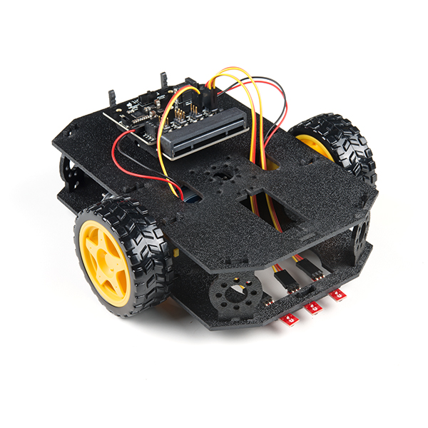

# motobit-projects

A repository for projects using SparkFun's [moto:bit](https://www.sparkfun.com/products/15713).

### `line_follow.py`

A script that commands the SparkFun [micro:bot](https://www.sparkfun.com/products/16275) to follow a 2 inch wide black line. This file includes the MotoBit class. Thus only this file needs to be flashed to have a functioning line following robot.

### line-follower

This directory (folder) contains a line following script and the imported class which performs low-level procedures.

### microbit

This directory enables intellisense on Visual Studio Code. Code was sourced from this repository https://github.com/PhonicCanine/microbit

## Flashing

If you have installed the micro:bit VS Code extension, then flash your `file_name.py` file by clicking the `Build current file to Micro:Bit` button on the top right of your window.

**or**

There are two other editors other than VS Code that can flash your python script to your micro:bit. The [mu-editor](https://codewith.mu/en/tutorials/1.0/microbit) or the [micro:bit Online Python Editor](https://python.microbit.org/v/2.0). I recommend downloading the [mu-editor](https://codewith.mu/en/tutorials/1.0/microbit) as their built-in REPL works great with the micro:bit.

## Materials Used

I recommend ordering the [micro:bit Go Bundle](https://www.sparkfun.com/products/14336) and [micro:bot kit](https://www.sparkfun.com/products/16275) together to avoid S&H costs, if you're only buying one robot set. For multiple sets of robots, purchase the [micro:bit board](https://www.sparkfun.com/products/14208) and [micro:bot kit](https://www.sparkfun.com/products/16275) instead for every robot set.

### micro:bit

### micro:bot

_micro:bit not included with the micro:bot kit._

### moto:bit

![moto:bit](media/moto-bit.jpg

_moto:bit included with the micro:bot kit._
